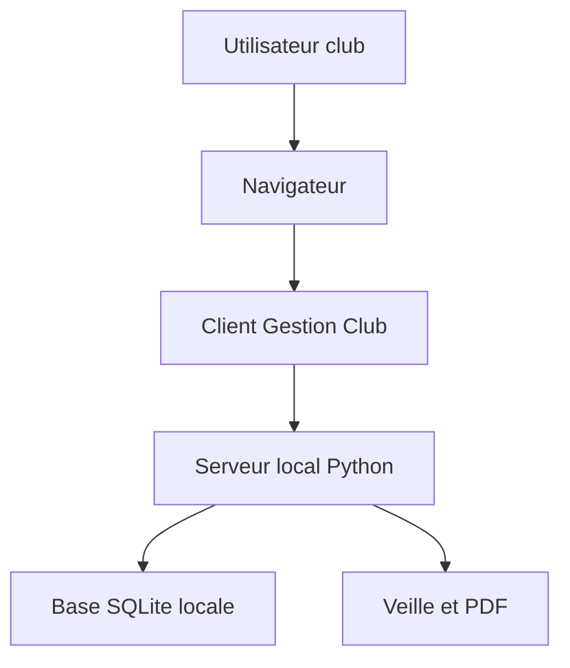
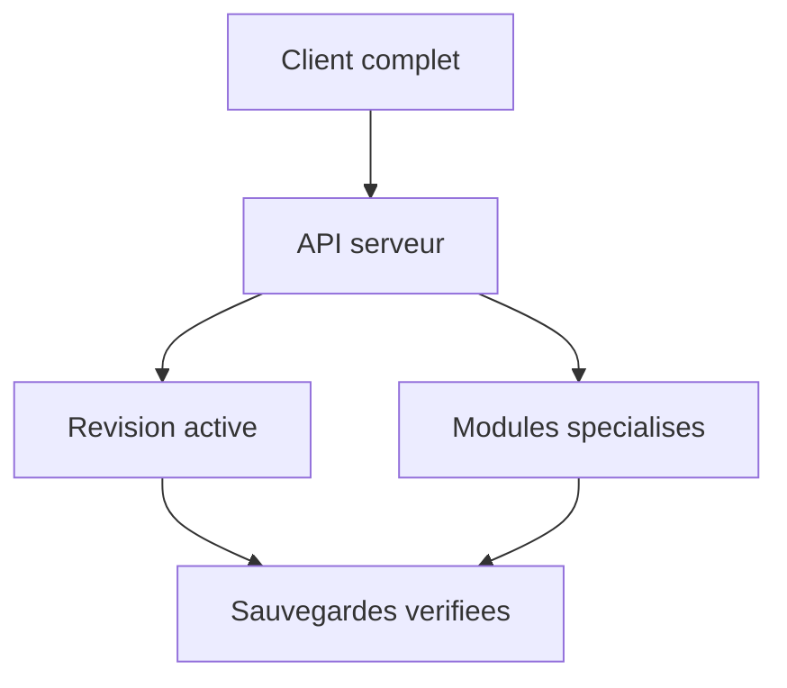

# Architecture

## Principe

Le navigateur affiche l'application. Le serveur local protege les acces, conserve les revisions de sauvegarde et fournit les modules de veille, PDF et convocations. La base SQLite locale reste sur le PC du club.

## Etat V1.25.12.3 importe

Le client principal reste encore largement monolithique dans `client/GESTION_CLUB_Manager.html`. Le serveur gere deja les revisions de sauvegardes completes, les droits d'acces et les modules de veille.

## Direction V1.25

Objectif : ouvrir toute l'application depuis le serveur, utiliser une base commune, puis transformer progressivement les sauvegardes completes en API metier plus fines.

## Limites volontaires

- Pas d'exposition Internet tant que la securite reseau n'est pas validee.
- Pas de donnees reelles dans Git.
- Pas de fusion automatique destructive entre la sauvegarde serveur et les donnees locales du navigateur.

